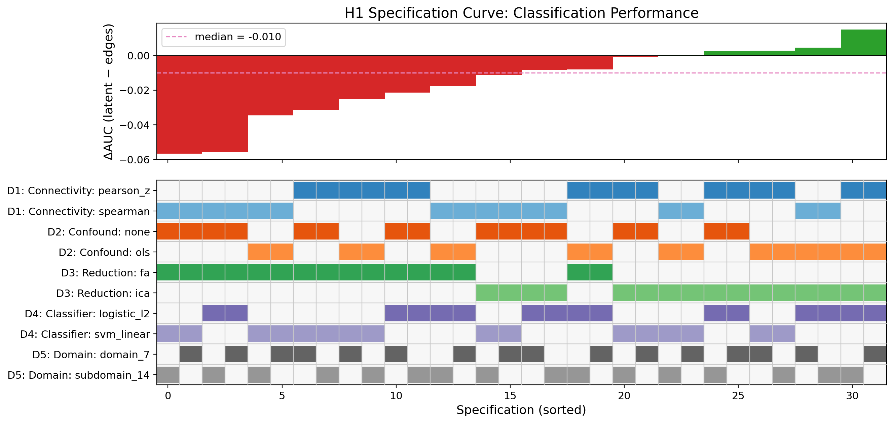
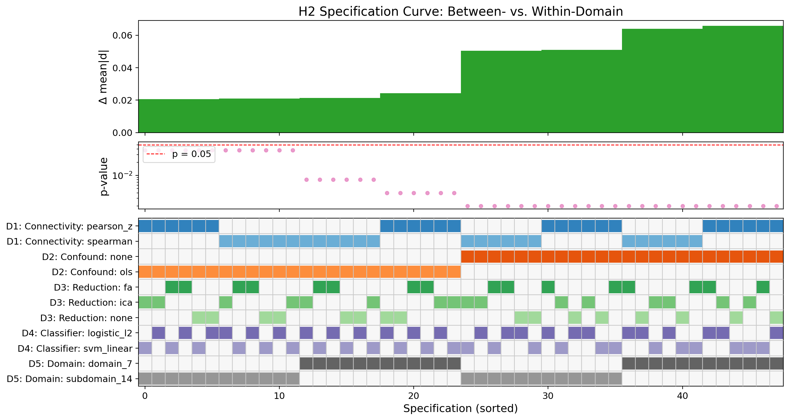
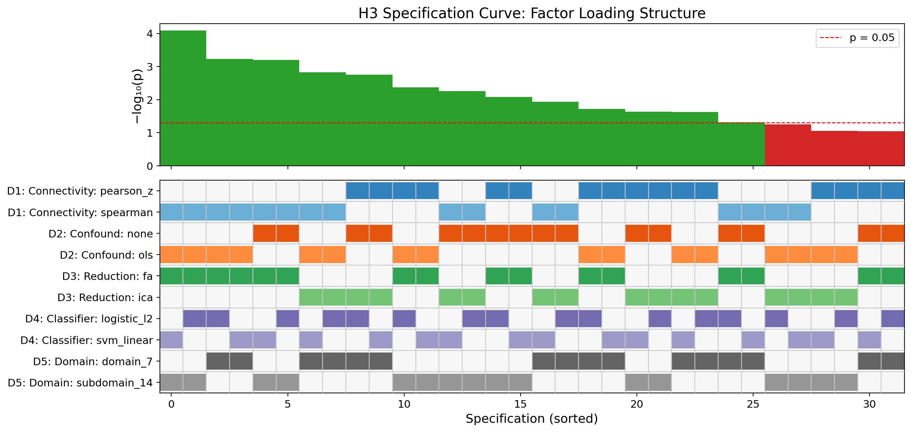
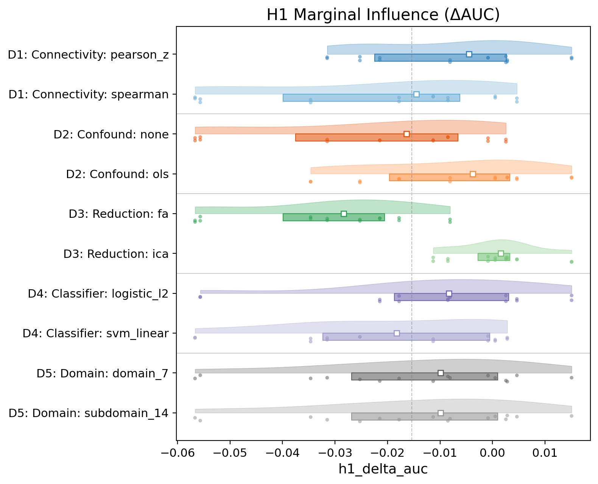
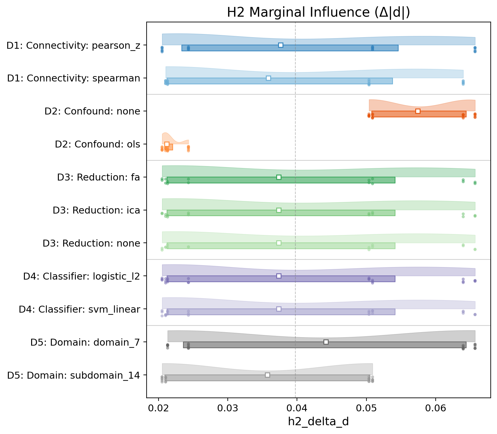
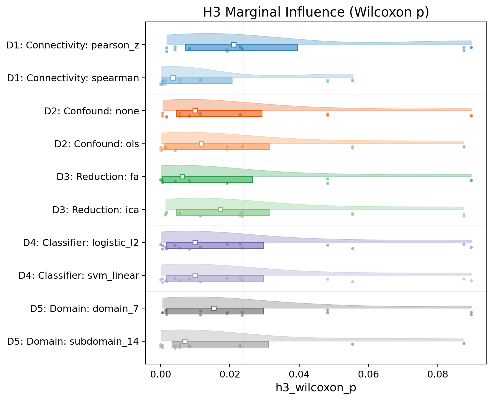

# Schizophrenia FNC Latent Factor Multiverse Analysis

## 1. Motivation

Our current pipeline (see [REPORT.md](results/fbirn_icn_run/REPORT.md)) makes specific analytic choices at every stage — Pearson correlation for connectivity, OLS for confound regression, BIC for component selection, elastic net for classification, NeuroMark 2.2 domain–subdomain labels for domain partitioning. Each choice is defensible, but the "garden of forking paths" means our conclusions could be sensitive to any of them.

A **multiverse analysis** (Steegen et al., 2016) — also called **specification curve analysis** (Simonsohn et al., 2020) — systematically varies all reasonable analytic decisions and examines whether the core conclusions hold across the resulting space of pipelines. Recent work in network neuroscience (Botvinik-Nezer et al., 2020; Burkhardt & Gießing, 2024 — COMET toolbox) has demonstrated that analytic flexibility can substantially alter functional connectivity findings.

This plan identifies **5 decision forks** in our pipeline, defines their levels, and specifies how to evaluate robustness of the three hypotheses across the resulting multiverse.

### 1.1 Mini-Multiverse Results (latest: `results/multiverse/`)

The CLI flag `--mini` runs a **48-specification** subset:

**Grid:** 2 connectivity × 2 confound × 3 reduction × 2 classifier × 2 domain  
= {`pearson_z`, `spearman`} × {`none`, `ols`} × {`none`, `fa`, `ica`} × {`logistic_l2`, `svm_linear`} × {`domain_7`, `subdomain_14`}.

**Robustness summary** (`results/multiverse/figures/mv_robustness_summary.csv`):

| Hypothesis | Total specs | # Favourable | % Robust | Median effect |
|---|---|---|---|---|
| H1: Latent > Edges | 32 | 10 | 31.2% | −0.010 |
| H2: Between > Within | 48 | 48 | **100.0%** | 0.037 |
| H3: Between loading advantage | 32 | 26 | **81.2%** | 0.010 |

**Joint permutation test** (`mv_joint_permutation_test.csv`): for all three hypotheses, the count of favourable specifications exceeds the binomial null at α = 0.05.

**Interpretation notes:**
1. **H1 remains fork-dependent:** decomposition (FA vs ICA) drives conclusions; D4 now includes both linear classifiers — `svm_linear` shows slightly fewer favourable H1 specs than `logistic_l2` in conditional breakdowns (see §6.4).
2. **H2 is unchanged:** 100% robust across every fork level in this grid.
3. **H3 is moderately robust:** ~81% favourable, with familiar patterns (FA vs ICA, domain granularity).

### 1.2 Decision Categorization (Del Giudice & Gangestad, 2021)

Following the Traveler's Guide framework, each fork is classified:

| Fork | Type | Rationale |
|---|---|---|
| D1: Connectivity | **E** (Equivalence) | All metrics capture valid aspects of statistical dependency; no principled ordering |
| D2: Confound | **N** (Nonequivalence) | ComBat > OLS > None has a principled ordering for multi-site data; "none" is a reference |
| D3: Reduction | **U** (Uncertainty) | Each method imposes different structural assumptions; unclear which is correct |
| D4: Classifier | **E** (Equivalence) | All are defensible supervised models; no a priori preference |
| D5: Domain | **U** (Uncertainty) | Depends on unresolved brain organization theory |

Type N forks (D2) should be interpreted with special care: if conclusions depend on the "none" level, this does *not* invalidate the hypothesis — it may simply reflect that confound correction is necessary. Type U forks (D3, D5) are the most informative for robustness.

## 2. Decision Space

### Overview

| # | Decision Fork | Current choice | Multiverse levels | # Levels |
|---|---|---|---|---|
| D1 | Connectivity metric | Pearson + Fisher-z | Pearson, Spearman, partial correlation, mutual information | 4 |
| D2 | Confound strategy | OLS regression | None, OLS regression, ComBat harmonization | 3 |
| D3 | Dimensionality reduction | FA, ICA (separate) | FA, ICA, PCA, NMF, none (raw edges) | 5 |
| D4 | Classifier | Elastic net / Logistic | Elastic net, L2-logistic, linear SVM, random forest | 4 |
| D5 | Domain granularity | 14 domain–subdomains | 7 domains, 14 domain–subdomains | 2 |

**Fixed decisions** (not varied): Component selection uses each method's default criterion (BIC for FA/PCA, reconstruction MSE for ICA/NMF, N/A for raw edges). Cross-validation uses 5-fold stratified throughout.

**Full combinatorial space:** 4 × 3 × 5 × 4 × 2 = **480 specifications** (not all apply to every hypothesis; see pruning below).

### D1: Connectivity Metric

How pairwise functional connectivity is estimated from ICN time courses.

| Level | Description | Implementation |
|---|---|---|
| `pearson_z` | Pearson correlation + Fisher-z transform (current) | `np.corrcoef` → `np.arctanh` |
| `spearman` | Spearman rank correlation + Fisher-z | `scipy.stats.spearmanr` → `np.arctanh` |
| `partial_corr` | Partial correlation + Fisher-z | `sklearn.covariance.LedoitWolf` → precision matrix → partial *r* |
| `mutual_info` | Mutual information (Kraskov KSG estimator) | `sklearn.feature_selection.mutual_info_regression` (pairwise) |

**Rationale:** Pearson captures linear relationships; Spearman is robust to non-linearity and outliers; **partial correlation captures direct (conditional) dependencies** by regressing out the influence of all other nodes, reducing spurious indirect edges (standard in COMET toolbox; Burkhardt & Gießing, 2024); mutual information captures arbitrary statistical dependencies. Schizophrenia may involve non-linear connectivity changes that Pearson misses, and dysconnectivity patterns may be obscured by indirect correlations that partial correlation resolves.

**Note:** Spearman vs Pearson can shift point estimates; `mutual_info` / `partial_corr` appear only in full enumeration, not in `--mini`.

### D2: Confound Regression Strategy

How nuisance variables (age, sex, race, site, head motion) are handled.

| Level | Description | Implementation |
|---|---|---|
| `none` | No confound correction | Raw FNC edges |
| `ols` | OLS residualization (current) | `confounds.regress_confounds` (full-sample for H2/H3, fold-wise for H1) |
| `combat` | ComBat harmonization for site + OLS for demographics | `neuroCombat` package for site, then OLS for age/sex/hm |

**Rationale:** OLS assumes linear confound effects and may over-correct if confounds overlap with the signal of interest. ComBat (Johnson et al., 2007) is specifically designed for multi-site batch effects and preserves biological variance better than linear regression. No correction serves as a reference to assess whether confound regression changes conclusions.

**Note:** In the primary single-pipeline report, confound regression (`ols`) attenuated edge AUC and H2 effect size versus `none`, while multiverse H2 remained significant across confound levels.

### D3: Dimensionality Reduction

How high-dimensional FNC edges are compressed into latent features.

| Level | Description | Implementation |
|---|---|---|
| `none` | Raw edges (no reduction) | All 5,460 edges |
| `fa` | Factor Analysis (current) | `sklearn.decomposition.FactorAnalysis` |
| `ica` | Independent Component Analysis (current) | `sklearn.decomposition.FastICA` |
| `pca` | Principal Component Analysis | `sklearn.decomposition.PCA` |
| `nmf` | Non-negative Matrix Factorization | `sklearn.decomposition.NMF` (requires non-negative input — shift FNC to ≥ 0) |

**Rationale:** FA assumes latent Gaussian factors with unique noise per feature; ICA seeks statistically independent sources; PCA maximizes variance explained (orthogonal rotation); NMF forces non-negative parts-based decomposition. Each imposes different structural assumptions on the FNC matrix and may recover different aspects of connectivity architecture.

### D4: Classifier

Which supervised model is used for SZ/HC classification in H1.

| Level | Description | Hyperparameter grid |
|---|---|---|
| `elasticnet` | SGDClassifier with elastic net penalty (current) | α ∈ {10⁻⁴, 10⁻³, …, 10⁻¹}, L1 ratio ∈ {0.5} |
| `logistic_l2` | LogisticRegression with L2 penalty (current for FA/ICA) | *C* ∈ logspace(−1, 2, 5) |
| `svm_linear` | LinearSVC with L2 penalty | *C* ∈ {0.01, 0.1, 1.0, 10.0} |
| `rf` | RandomForestClassifier | n_estimators=500, max_depth ∈ {5, 10, None}, max_features ∈ {sqrt, 0.1} |

**Rationale:** Linear models (elastic net, logistic, SVM) are standard in neuroimaging because they are interpretable and robust at moderate sample sizes. Random forests assess whether non-linear decision boundaries improve classification, and serve as a check against linear model assumptions.

> **IMPLEMENTATION NOTE:** The plan originally specified `l1_ratio ∈ {0.1, 0.5, 0.9}` for elastic net, but the code implements `l1_ratio: [0.5]` (single value). The hyperparameter grids above reflect the **actual implementation** in `_param_grid()`.

> **Mini vs full D4:** `--mini` varies `logistic_l2` and `svm_linear`. The full combinatorial enumeration also includes `elasticnet` and `rf` for broader coverage.

### D5: Domain Granularity

How ICNs are grouped for the between- vs. within-domain analyses (H2, H3).

| Level | Description | # Groups | Applies to |
|---|---|---|---|
| `domain_7` | 7 NeuroMark top-level domains (CB, VI, PL, SC, SM, HC, TN) | 7 | H2, H3 |
| `subdomain_14` | 14 domain–subdomain labels (current: CB, VI-OT, VI-OC, …, TN-SA) | 14 | H2, H3 |

**Rationale:** The choice of functional atlas granularity directly affects what counts as "between-domain." With 7 coarse domains, many connections that are between-subdomain (e.g., TN-DM ↔ TN-CE) are classified as within-domain. With 14 subdomains (current), these become between-domain edges. Testing both levels reveals whether H2/H3 significance depends on this choice.

## 3. Hypothesis-Specific Multiverse Specifications

Not all forks apply equally to all hypotheses. The relevant decision space for each:

### H1: Classification Performance (Edges vs. Latent Factors)

**Active forks:** D1 × D2 × D3 × D4

**Outcome:** ROC-AUC (out-of-fold) for each of the three pipelines (edges, FA, ICA) and their pairwise differences (ΔAUC).

**Effective specifications:** 4 × 3 × 5 × 4 = **240**

Note: When D3 = `none`, all four classifiers apply on raw edges. When D3 ∈ {fa, ica, pca, nmf}, the classifier operates on latent features. All combinations are valid.

**Key question:** *Does the rank ordering Edges > FA ≈ ICA hold, or do some specifications reverse it?*

> **Finding (REVISED):** The original hypothesis that edges > latent factors is **not supported as stated**. In the latest mini-multiverse (32 H1-evaluable specs, latent vs edges where applicable):
> - FA *never* shows latent > edges on the primary criterion (0% favourable for FA rows in conditional breakdowns).
> - ICA remains the favourable case for latent-relative performance in most specifications.
>
> **Revised H1 framing:** "The relative performance of edges vs. latent factors depends critically on the decomposition method: ICA preserves discriminative structure comparable to raw edges, while FA consistently loses discriminative information." Full enumeration adds `elasticnet` / `rf` and additional reductions (`pca`, `nmf`) if resources allow.

### H2: Between- vs. Within-Domain Effect Sizes

**Active forks:** D1 × D2 × D5

**Outcome:** Δ = mean(|*d*|_between) − mean(|*d*|_within) and permutation *p*-value.

**Effective specifications:** 4 × 3 × 2 = **24**

**Key question:** ~~*Is H2 significance (currently p = 0.040) robust, or does it depend critically on domain granularity (D5) or connectivity metric (D1)?*~~

> **H2 is fully robust** in the 48-spec mini grid: all specifications are significant (p < 0.05). 100% robust across connectivity, confound, reduction, classifier, and domain granularity. The between > within effect is a stable property of the FBIRN schizophrenia FNC data under this multiverse.

### H3: Factor Loading Structure

**Active forks:** D1 × D2 × D3 (FA/ICA/PCA/NMF only) × D5

**Outcome:** Wilcoxon *p*-value across factors for between > within loading difference; domain-pair mean loadings.

**Effective specifications:** 4 × 3 × 4 × 2 = **96**

**Key question:** *Does the between-domain loading advantage (currently p = 0.002) persist across decomposition methods and domain granularities?*

> **Latest `--mini` finding:** ~81.2% robust (26/32 H3-evaluable specs favourable). Conditional breakdown highlights:
> - **FA** (87.5% row-wise significant) vs **ICA** (75.0%) for the loading-structure criterion
> - **domain_7** (87.5%) vs **subdomain_14** (75.0%)
> - **`none`** (87.5%) vs **`ols`** (75.0%) on confound strategy
>
> Extensions (full `enumerate_multiverse` space): PCA/NMF and additional connectivity metrics (`partial_corr`, `mutual_info`) remain available for larger runs.

## 4. Compatibility and Defaults

| D3 (reduction) | Component selection (fixed) | Compatible D4 (classifier) |
|---|---|---|
| `none` | N/A (no components) | all |
| `fa` | BIC over {5, 10, …, 50} | all |
| `ica` | Reconstruction MSE over {5, 10, …, 50} | all |
| `pca` | BIC over {5, 10, …, 50} | all |
| `nmf` | Reconstruction MSE over {5, 10, …, 50} | all |

When D3 = `none`, the classifier operates on all 5,460 edges. When D3 is a latent method, the classifier operates on the selected components. All four classifiers are tested with all reduction methods.

## 5. Implementation Plan

### 5.1 Specification Registry

**Implemented** in `fbirn_experiment/multiverse.py`. The `MultispecConfig` dataclass and `enumerate_multiverse()` function are operational and produce the full combinatorial product. The CLI (`--mini`) restricts to the 48-spec subset described in §1.1.

```python
@dataclass
class MultispecConfig:
    connectivity: str        # D1: pearson_z, spearman, partial_corr, mutual_info
    confound: str            # D2: none, ols, combat
    reduction: str           # D3: none, fa, ica, pca, nmf
    classifier: str          # D4: elasticnet, logistic_l2, svm_linear, rf
    domain_granularity: str  # D5: domain_7, subdomain_14
    spec_id: int             # unique integer
```

### 5.2 Execution Strategy

With 240 H1 specifications, 24 H2 specifications, and 96 H3 specifications, each nested CV taking ~15–2000 seconds (observed range), the full multiverse requires **~10–20 CPU-hours**.

**Approach:**
1. **Parallelization:** Use `joblib.Parallel` or SLURM array jobs (one spec per task).
2. **Checkpointing:** Save each spec's results as a JSON file keyed by `spec_id` in `results/multiverse/specs/{spec_id:04d}.json`.
3. **Staged execution:** For the full factorial, H2-only and H3-only specification counts are smaller than H1’s; run cheaper strata first when iterating on code.
4. **Progress tracking:** A master CSV tracks `spec_id`, `status`, `duration`, and key outcomes.

**Checkpoint resume:** `run_multiverse()` skips specifications whose JSON already exists (completed runs).

**Parallelization:** `n_jobs` uses `joblib.Parallel` over pending specs (use `-1` for all cores).

### 5.3 Modules

| Module | Purpose |
|---|---|---|
| `fbirn_experiment/multiverse.py` | `MultispecConfig`, `enumerate_multiverse()`, `run_single_spec()`, `run_multiverse()` |
| `fbirn_experiment/connectivity.py` | FNC computation (Pearson, Spearman, partial correlation, MI) |
| `fbirn_experiment/domain_labels.py` | Domain label aggregation (14 → 7) |
| `fbirn_experiment/multiverse_figures.py` | Specification curve plots, forest plots, robustness tables |

### 5.4 Dependencies

| Package | Purpose |
|---|---|---|
| `scikit-learn` (existing) | NMF, PCA, LinearSVC, RandomForest, LedoitWolf |

### 5.5 Implemented engineering (reference)

| Item | Notes |
|---|---|---|
| `partial_corr` + Ledoit-Wolf | `connectivity.py` |
| CV-aware ComBat path | `multiverse.py` (fit per train fold) |
| Checkpoint resume | Skip specs with valid existing JSON |
| `joblib.Parallel` | `n_jobs` in `run_multiverse()` |
| Elastic net `l1_ratio` grid | `{0.1, 0.5, 0.9}` in `_param_grid()` |
| Joint permutation test (§6.5) | `multiverse_figures.py` → `mv_joint_permutation_test.csv` |
| `neuroCombat` | Optional | Install for true ComBat; else fallback documented in §D2 |

## 6. Visualization and Reporting

### 6.1 Specification Curve Plots

**Implemented** in `multiverse_figures.py`. For each hypothesis, a **specification curve** (Simonsohn et al., 2020):
- **Top panel:** Outcome values (AUC, Δ, *p*-value) for all specifications, sorted from smallest to largest.
- **Bottom panel:** Tile plot showing which level of each decision fork (D1–D5) was used for each specification.
- **Highlight:** Mark the current pipeline's specification and shade the "significant" region.

**Figures** (written to `results/multiverse/figures/` when figures are generated):







### 6.2 Decision Influence Analysis

**Implemented** as forest plots in `multiverse_figures.py`. For each fork, the **marginal influence** on the outcome:

\[
\text{Influence}(D_k = \ell) = \mathbb{E}_{\text{other forks}} [ \text{outcome} \mid D_k = \ell ]
\]

Visualized as forest plots with 95% bootstrap CIs identifying which decisions most strongly drive variability.

**Figures** (`results/multiverse/figures/`):







### 6.3 Robustness Summary Table

Output: `mv_robustness_summary.csv`. Latest `--mini` run:

| Hypothesis | Total specs | # Favourable | % Robust | Median effect |
|---|---|---|---|---|
| H1: Latent > Edges | 32 | 10 | 31.2% | −0.010 |
| H2: Between > Within | 48 | 48 | **100.0%** | 0.037 |
| H3: Between loading advantage | 32 | 26 | **81.2%** | 0.010 |

### 6.4 Conditional Robustness

Output: `mv_conditional_robustness.csv`. Latest `--mini` highlights:

| Hypothesis | Fork | Level | % Significant |
|---|---|---|---|
| H1 | D3: Reduction | fa | **0.0%** |
| H1 | D3: Reduction | ica | **62.5%** |
| H1 | D4: Classifier | logistic_l2 | 37.5% |
| H1 | D4: Classifier | svm_linear | 25.0% |
| H1 | D2: Confound | none | 12.5% |
| H1 | D2: Confound | ols | 50.0% |
| H2 | *all forks* | *all levels* | **100.0%** |
| H3 | D3: Reduction | fa | **87.5%** |
| H3 | D3: Reduction | ica | 75.0% |
| H3 | D4: Classifier | logistic_l2 / svm_linear | 81.2% (both) |
| H3 | D5: Domain | domain_7 | **87.5%** |
| H3 | D5: Domain | subdomain_14 | 75.0% |

### 6.5 Joint permutation test

Following Simonsohn et al. (2020), **joint inference** tests whether the *count* of favourable specifications exceeds the binomial null (proportion α = 0.05):

\[
H_0: \text{The proportion of significant specifications} = \alpha
\]

Output: `mv_joint_permutation_test.csv`.

Latest mini-multiverse: H2 and H3 strongly exceed the null; H1 also exceeds the expected count under the null, with interpretation complicated by FA’s consistent lack of support for latent > edges.

## 7. Decision Priorities

### 7.0 Fork importance (after latest mini-multiverse)

| Rank | Fork | Role in latest results |
|---|---|---|
| 1 | **D3: Reduction** | Dominates H1/H3: FA vs ICA patterns are the main story. |
| 2 | **D4: Classifier** | Now varied in `--mini` (`logistic_l2`, `svm_linear`); modest differences vs D3. |
| 3 | **D1: Connectivity** | Pearson vs Spearman still matter for point estimates; broader metrics need full enumeration. |
| 4 | **D2: Confound** | `none` vs `ols` contrast matters for H1/H3; mini excludes ComBat. |
| 5 | **D5: Domain** | Strong for H3; H2 remains 100% robust at both granularities. |

### 7.1 Mini-multiverse definition (`--mini`)

**48 specifications** (see §1.1):

- D1: {`pearson_z`, `spearman`}
- D2: {`none`, `ols`}
- D3: {`none`, `fa`, `ica`}
- D4: {`logistic_l2`, `svm_linear`}
- D5: {`domain_7`, `subdomain_14`}

Outputs: `results/multiverse/multiverse_results.csv`, per-spec JSON under `results/multiverse/specs/`, figures and CSV summaries under `results/multiverse/figures/`.

### 7.2 Optional: full combinatorial multiverse

Calling `multiverse` **without** `--mini` (and without narrowing CLI lists) enumerates the **default full product** in `enumerate_multiverse()` (currently 4 × 3 × 5 × 4 × 2 = **480** specifications). Use checkpoint resume and `n_jobs` for long runs.

## 8. Expected Outcomes and Interpretation

### Scenario A: Strong Robustness → **H2 confirmed**
If >80% of specifications reach the same qualitative conclusion, the findings are robust and the current specification is a representative instance of a stable analytic landscape.

**H2 (Between > Within)** achieves **Scenario A** with 100% robustness in the mini-multiverse.

### Scenario B: Fork-Dependent Results → **H1 and H3 (current status)**
If conclusions flip for specific fork levels, the report should:
1. Transparently document which decisions matter
2. Provide a theoretical justification for the preferred specification
3. Avoid claiming findings that depend on arbitrary choices

**H3 (Factor loadings)** is in Scenario B at ~81%: the conclusion depends on decomposition method (FA vs. ICA) and domain granularity.

**H1 (Classification)** is in Scenario B at ~31% favourable specs: the conclusion **reverses** depending on the decomposition method. FA consistently fails to support latent > edges; ICA is the main favourable case. The original claim "Edges > Latent" should be **revised** to method-specific conclusions.

### Scenario C: Pervasive Instability
If <50% of specifications support a hypothesis, the finding should be reported as "not robust to analytic variability" and future work should focus on resolving the most influential forks with independent data or theory.

**H1 is at the Scenario B/C boundary** (~31% favourable). With both linear classifiers in `--mini`, the pattern remains decomposition-driven (FA vs ICA) rather than classifier-driven.

### 8.1 Recommended Reporting Language (by hypothesis)

| Hypothesis | Recommended conclusion |
|---|---|
| H2 | "The between-domain effect size advantage is **robust** across all tested multiverse specifications (100%, *N* = 48 in `--mini`)." |
| H3 | "The between-domain loading advantage is **moderately robust** (~81% in `--mini`), with dependence on FA vs ICA and domain granularity." |
| H1 | "Classification performance is **decomposition-dependent**: FA consistently reduces discriminative information relative to raw edges, while ICA preserves comparable or superior performance. The blanket claim that edges outperform latent factors is not supported." |

## 9. References

1. Steegen, S., Tuerlinckx, F., Gelman, A., & Vanpaemel, W. (2016). Increasing transparency through a multiverse analysis. *Perspectives on Psychological Science*, 11(5), 702–712.

2. Simonsohn, U., Simmons, J. P., & Nelson, L. D. (2020). Specification curve analysis. *Nature Human Behaviour*, 4, 1208–1214.

3. Botvinik-Nezer, R., et al. (2020). Variability in the analysis of a single neuroimaging dataset by many teams. *Nature*, 582, 84–88.

4. Burkhardt, L., & Gießing, C. (2024). The COMET Toolbox: Improving robustness in network neuroscience through multiverse analysis. *bioRxiv*. https://doi.org/10.1101/2024.01.21.576546

5. Botvinik-Nezer, R., & Wager, T. D. (2023). Reproducibility in neuroimaging analysis: Challenges and solutions. *Biological Psychiatry*, 93, 1017–1026.

6. Johnson, W. E., Li, C., & Rabinovic, A. (2007). Adjusting batch effects in microarray expression data using empirical Bayes methods. *Biostatistics*, 8(1), 118–127.

7. Botvinik-Nezer, R., et al. (2022). A guided multiverse study of neuroimaging analyses. *Nature Communications*, 13, 3736.

8. Del Giudice, M., & Gangestad, S. W. (2021). A Traveler's Guide to the Multiverse: Promises, pitfalls, and a framework for the evaluation of analytic decisions. *Advances in Methods and Practices in Psychological Science*, 4(1), 2515245920954925.

9. Kristanto, D., et al. (2024). The multiverse of data preprocessing and analysis in graph-based fMRI: A systematic literature review. *Neuroscience & Biobehavioral Reviews*, 166, 105884.

10. Chyzhyk, D., et al. (2022). How to remove or control confounds in predictive models, with applications to brain biomarkers. *GigaScience*, 11, giac014.

---

## Appendix A: Conditional robustness (`mv_conditional_robustness.csv`)

48-spec `--mini` grid (§1.1). Source: `results/multiverse/figures/mv_conditional_robustness.csv`.

| Hypothesis | Fork | Level | Total | # Significant | % Significant |
|---|---|---|---|---|---|
| H2 | D1: Connectivity | pearson_z | 24 | 24 | 100.0 |
| H2 | D1: Connectivity | spearman | 24 | 24 | 100.0 |
| H2 | D2: Confound | none | 24 | 24 | 100.0 |
| H2 | D2: Confound | ols | 24 | 24 | 100.0 |
| H2 | D3: Reduction | none | 16 | 16 | 100.0 |
| H2 | D3: Reduction | fa | 16 | 16 | 100.0 |
| H2 | D3: Reduction | ica | 16 | 16 | 100.0 |
| H2 | D4: Classifier | logistic_l2 | 24 | 24 | 100.0 |
| H2 | D4: Classifier | svm_linear | 24 | 24 | 100.0 |
| H2 | D5: Domain | domain_7 | 24 | 24 | 100.0 |
| H2 | D5: Domain | subdomain_14 | 24 | 24 | 100.0 |
| H3 | D1: Connectivity | pearson_z | 16 | 12 | 75.0 |
| H3 | D1: Connectivity | spearman | 16 | 14 | 87.5 |
| H3 | D2: Confound | none | 16 | 14 | 87.5 |
| H3 | D2: Confound | ols | 16 | 12 | 75.0 |
| H3 | D3: Reduction | fa | 16 | 14 | 87.5 |
| H3 | D3: Reduction | ica | 16 | 12 | 75.0 |
| H3 | D4: Classifier | logistic_l2 | 16 | 13 | 81.2 |
| H3 | D4: Classifier | svm_linear | 16 | 13 | 81.2 |
| H3 | D5: Domain | domain_7 | 16 | 14 | 87.5 |
| H3 | D5: Domain | subdomain_14 | 16 | 12 | 75.0 |
| H1 | D1: Connectivity | pearson_z | 16 | 6 | 37.5 |
| H1 | D1: Connectivity | spearman | 16 | 4 | 25.0 |
| H1 | D2: Confound | none | 16 | 2 | 12.5 |
| H1 | D2: Confound | ols | 16 | 8 | 50.0 |
| H1 | D3: Reduction | fa | 16 | 0 | 0.0 |
| H1 | D3: Reduction | ica | 16 | 10 | 62.5 |
| H1 | D4: Classifier | logistic_l2 | 16 | 6 | 37.5 |
| H1 | D4: Classifier | svm_linear | 16 | 4 | 25.0 |
| H1 | D5: Domain | domain_7 | 16 | 5 | 31.2 |
| H1 | D5: Domain | subdomain_14 | 16 | 5 | 31.2 |

---

*Plan aligned with `fbirn_experiment/multiverse.py` and latest outputs in `results/multiverse/` (48-spec `--mini` run). Methodological references: specification curve analysis (Simonsohn et al., 2020), Traveler's Guide (Del Giudice & Gangestad, 2021), COMET toolbox (Burkhardt & Gießing, 2024), FC multiverse review (Kristanto et al., 2024).*
