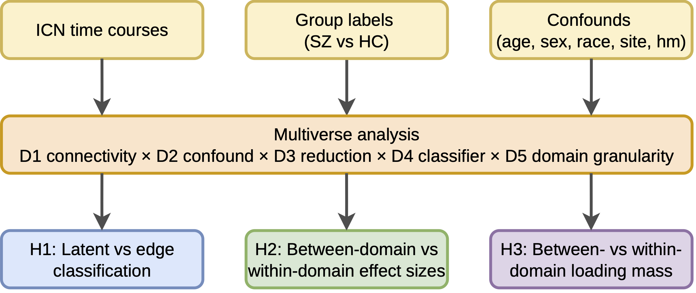
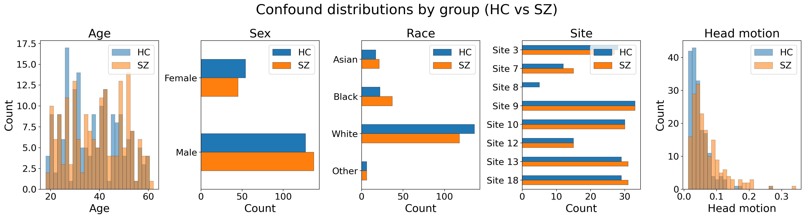
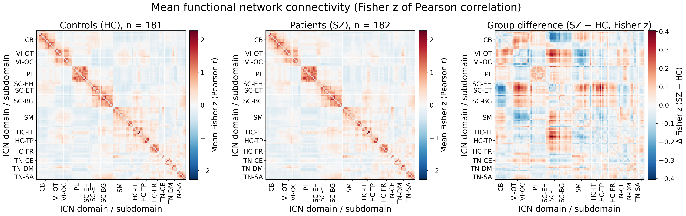
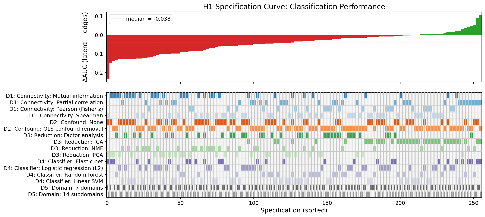
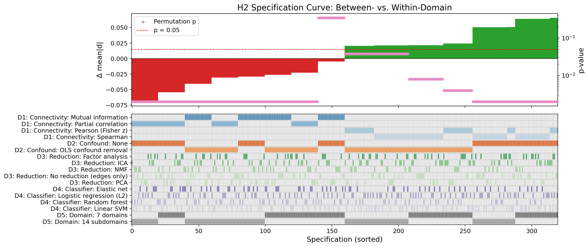
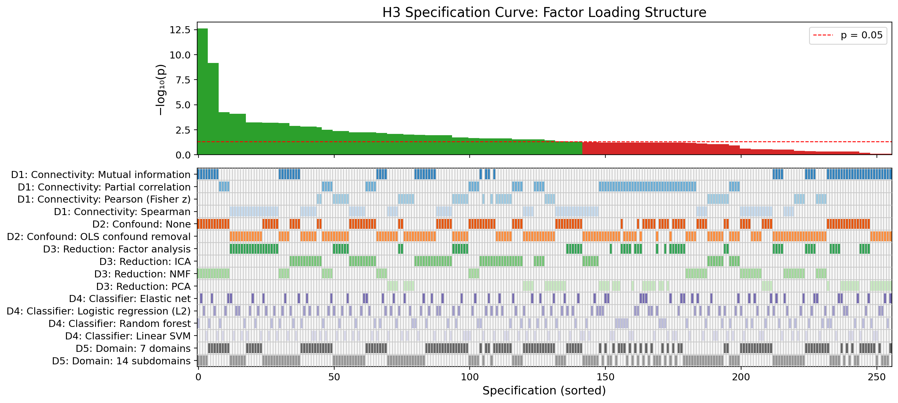
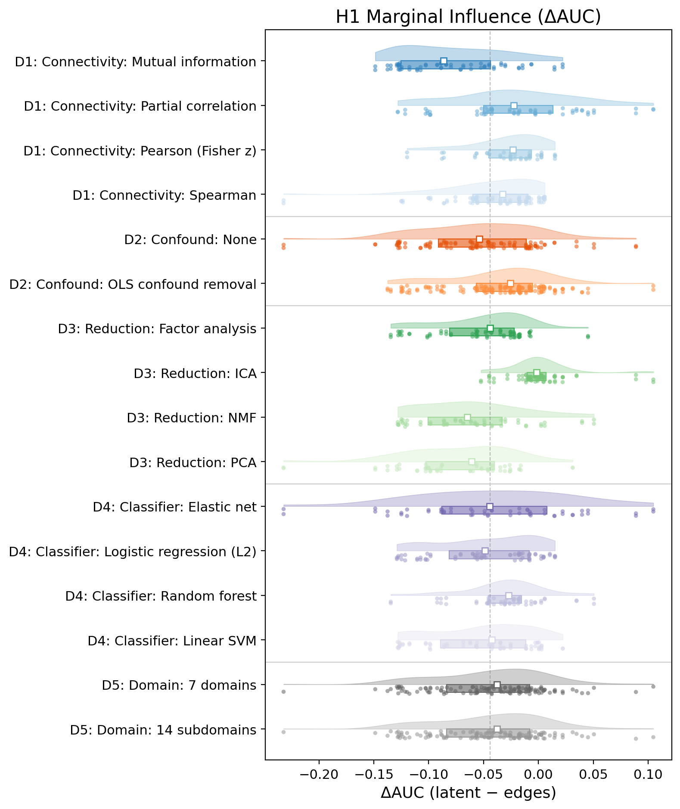
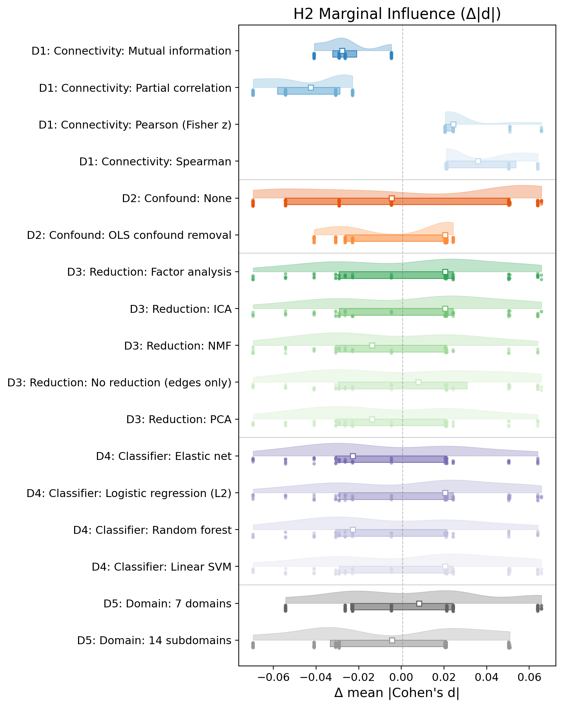
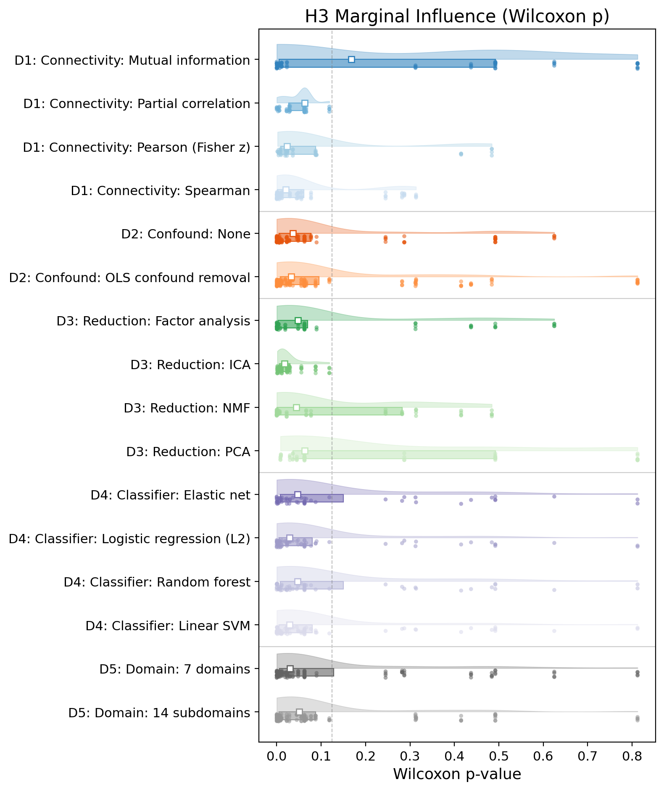

# Schizophrenia Functional Network Connectivity - Multiverse Analysis

Multiverse / specification-curve analysis (Steegen et al., 2016; Simonsohn et al., 2020) varies analytic choices across **five forks** (connectivity, confound, reduction, classifier, domain) and tests robustness of three hypotheses. Operational definitions and **what the full run supports** are summarized below; counts come from `results/multiverse_full/multiverse_results.csv` for the **320**-specification grid.

### Hypotheses (what each test measures)

- **H1 — Latent vs edge classification.** For each specification, the same FC **edge features** support two nested-CV pipelines: **all edges** vs **edges projected to *k* latent components** (FA, ICA, PCA, or NMF; *k* chosen in-fold). The multiverse outcome is **ΔAUC = mean outer-fold ROC-AUC(latent) − mean outer-fold ROC-AUC(edges)**. A specification counts as **favourable** if **ΔAUC > 0** (latent strictly better on average). Rows with `reduction = none` have no latent arm and are excluded from H1 summaries (**256** evaluable specs in the saved full run).

- **H2 — Between-domain vs within-domain effect sizes.** Per edge, **Cohen’s *d*** for SCZ vs HC is computed. The statistic is **Δ mean|*d*| = mean(|*d*| on between-domain edges) − mean(|*d*| on within-domain edges)** (domain masks follow the chosen **D5** granularity). A **label permutation** of ICN domain assignments yields a **two-sided *p***. A spec is **favourable** if ***p* < 0.05**. H2 uses the (possibly confound-adjusted) edge matrix only; **all 320** specifications with finite `h2_p` enter the summary.

- **H3 — Between- vs within-domain loading mass.** After fitting the chosen reducer on scaled edges, each component’s **mean |loading|** is compared **between-domain vs within-domain**. Across components, paired differences are tested with a **Wilcoxon signed-rank** on those differences (see `fbirn_experiment/multiverse.py`). A spec is **favourable** if **Wilcoxon *p* < 0.05**. Like H1, H3 requires a latent decomposition (**256** evaluable specs with `reduction ≠ none`).

### Key takeaways from `results/multiverse_full`

| Hypothesis | Supported in the multiverse sense? | Typical “winning” settings (from `mv_conditional_robustness.csv`) |
|------------|-------------------------------------|-------------------------------------------------------------------|
| **H1** | **No** as a default claim: only **18.0%** of latent specs have ΔAUC > 0; **median ΔAUC = −0.0377** (edges often win on average). The joint binomial test still flags **more** positive-Δ specs than a strict global null—so some analytic paths favour latent, but they are a **minority**. | **ICA** reduction (**47%** favourable within ICA rows) vs **FA/PCA** (~3–4%). **OLS** confounds (**23.6%**) vs **none** (**10.7%**). **Partial correlation** connectivity (**28.1%**) vs **mutual information** (**6.2%**). Domain granularity makes little difference (~18% for both D5 levels). |
| **H2** | **Yes**, very strongly: **93.8%** of specs have permutation ***p* < 0.05**; median Δ mean|d| = 0.0079 (> 0). | Nearly all fork slices are majority favourable; **100%** under **Pearson (Fisher z)**, **Spearman**, **partial correlation**, **OLS** confounds, and **14 subdomains**. Relatively weaker (still majority): **mutual information** (**75%**), **`confound = none`** (**86.1%**), **7 domains** (**87.5%**). |
| **H3** | **Partially**: **55.5%** of latent specs have Wilcoxon ***p* < 0.05**; **median *p* = 0.033** (often significant but not universal). | **ICA** (**77.8%** favourable) stands out vs **PCA** (**35.7%**) or **NMF** (**50%**). **Pearson** (**66.7%**) and **Spearman** (**67.5%**) beat **partial correlation** (**37.5%**) and **mutual information** (**50%**). **14 subdomains** is not uniformly better than **7 domains** here (**50%** vs **60.9%**). |

**Joint specification-count test** (`figures/mv_joint_permutation_test.csv`): for α = 0.05, the number of favourable specs **exceeds** the binomial null for **all three** hypotheses (including H1), which is consistent with **some** sensitivity of the global null to multiple testing structure—not with blanket latent superiority for H1.

---

## Full multiverse in this repo (`results/multiverse_full/`)

A **full factorial** run is saved under `results/multiverse_full/`: **320** specifications in `multiverse_results.csv`, from the grid **4×2×5×4×2** (confound **without** ComBat: **`none`** and **`ols`** only).

Tables and figures use rows with finite outcomes (e.g. **320** specs with valid H2; **256** with latent reduction for H1/H3, i.e. `reduction ≠ none`).

### Fork grid (full default)

| Fork | Levels |
|------|--------|
| **D1** Connectivity | `pearson_z`, `spearman`, `partial_corr`, `mutual_info` |
| **D2** Confound | `none`, `ols` |
| **D3** Reduction | `none`, `fa`, `ica`, `pca`, `nmf` |
| **D4** Classifier | `elasticnet`, `logistic_l2`, `svm_linear`, `rf` |
| **D5** Domain | `domain_7`, `subdomain_14` |
| **Count** | **320** = 4×2×5×4×2 |

Full run (320-spec grid): `python -m fbirn_experiment.cli multiverse --out results/multiverse_full --confound-strategies none ols --n-jobs -1` (completed specs are skipped via `specs/*.json` checkpoints).

### Robustness summary (full grid)

Source: `results/multiverse_full/figures/mv_robustness_summary.csv` (same logic as `multiverse_figures.robustness_table()` on the filtered dataframe).

| Hypothesis | Specs (evaluable) | Favourable | % | Median effect |
|------------|-------------------|------------|---|---------------|
| H1: Latent > edges | 256 | 46 | 18.0% | −0.0377 |
| H2: Between > within | 320 | 300 | **93.8%** | 0.0079 |
| H3: Between loading advantage | 256 | 142 | **55.5%** | 0.0330 |

Joint binomial test (`results/multiverse_full/figures/mv_joint_permutation_test.csv`): for each hypothesis the count of favourable specs exceeds the α = 0.05 binomial null (*n* as in the table). Interpretation of H1 vs that test is spelled out in **Key takeaways** above.

---

## Study design



---

## Data

Covariate / confound distributions (`figures/confound_distributions.png`) and group-mean functional connectivity (Pearson *z*) for controls vs schizophrenia patients (`figures/mean_fnc_pearson_z_hc_sz.png`). Regenerate with `python -m fbirn_experiment.cli plot-confounds` and `python -m fbirn_experiment.cli mean-fnc-matrices`.





---

## Figures (full)

Specification curves and raincloud “forest” plots live in `results/multiverse_full/figures/`:













---

## Quick run (`--mini`, 48 specs)

For a small grid, use:

```bash
python -m fbirn_experiment.cli multiverse --mini --out results/multiverse
```

| Fork | `--mini` levels |
|------|-----------------|
| **D1** | `pearson_z`, `spearman` |
| **D2** | `none`, `ols` |
| **D3** | `none`, `fa`, `ica` |
| **D4** | `logistic_l2`, `svm_linear` |
| **D5** | `domain_7`, `subdomain_14` |

Mini figures/CSVs: `results/multiverse/figures/` (not the same numbers as the full run above).

---

## CLI

From the repository root, put the package on `PYTHONPATH` (e.g. `export PYTHONPATH="$PWD"`) or install the project in editable mode.

### Single-pipeline experiment (`run`)

Default pipeline: one fixed analytic specification — nested CV for **H1** (all FNC edges with **L2 logistic regression** vs **ICA** latent features; add **`--h1-include-fa`** for FA in H1), **H2** domain permutation test, **H3** **ICA** loadings on edges (FastICA; automatic *k* via reconstruction MSE unless **`--h3-no-bic`**; use **`--h3-fa`** for factor analysis + BIC *k*) — implemented in `fbirn_experiment/pipeline.py`.

```bash
python -m fbirn_experiment.cli run --out results/fbirn_icn_run
```

Defaults use `fbirn_experiment.config` paths for time courses (`--tc`) and labels (`--labels`) when those files exist. Common options: `--confounds-csv`, `--no-confounds`, `--outer-splits`, `--inner-splits`, `--no-figures`, `--no-save`, `--h1-include-fa`.

**H1 stability and interpretability (single run):** `artifacts/h1_stability_tests.json` — Levene and Fligner tests on outer-fold AUCs. `artifacts/h1_interpretability_meta.json` and `h1_interpretability_coefs.npz` — full-sample refits at **median** nested-CV hyperparameters. Figures: `figures/h1_auc_stability_violin.png`, `h1_edge_top_coefficients.png`, `h1_ica_latent_interpretability.png`, and `h1_fa_latent_interpretability.png` only if H1 included FA (`--h1-include-fa`). Coefficients are exploratory, not nested-CV unbiased.

**Regenerate H1 latent figures from artifacts only:**

```bash
python -m fbirn_experiment.cli regen-h1-latent-figs --run-dir results/fbirn_icn_run
```

### Multiverse analysis (`multiverse`)

```bash
# Mini (48 specs)
python -m fbirn_experiment.cli multiverse --mini --out results/multiverse

# Full factorial (320 specs: none + ols); parallel workers; resume via specs/*.json
python -m fbirn_experiment.cli multiverse --out results/multiverse_full --confound-strategies none ols --n-jobs -1

# Custom slice
python -m fbirn_experiment.cli multiverse \
  --connectivity pearson_z spearman \
  --confound-strategies none ols \
  --reductions none fa ica \
  --classifiers logistic_l2 \
  --granularities domain_7 subdomain_14
```

**Regenerate multiverse figures from an existing `multiverse_results.csv` (no recompute):**

```bash
python -m fbirn_experiment.cli regen-multiverse-figs --multiverse-dir results/multiverse_full
# or: --results-csv path/to/multiverse_results.csv [--figures-dir path/to/out]
```

Multiverse flags: `--out`, `--no-figures`, `--synthetic`, `--h2-perm`, `--n-jobs`, plus per-fork overrides listed earlier.

---

## Implementation notes

- **Checkpoint resume:** completed `specs/{spec_id:04d}.json` are skipped.
- **Parallelism:** `joblib` + `n_jobs`.
- **Connectivity:** Pearson / Spearman / partial correlation (Ledoit–Wolf) / mutual information — see `connectivity.py`.
- **ComBat:** optional third confound level in `multiverse.py` (`--confound-strategies combat`) if `neuroCombat` is installed; not part of the **320**-spec README grid above.
- **Multiverse figure labels:** human-readable fork levels (e.g. “Mutual information”) via `multiverse_figures.format_fork_level`.

---

## References

1. Steegen et al. (2016). Multiverse analysis. *Perspectives on Psychological Science*.
2. Simonsohn et al. (2020). Specification curve analysis. *Nature Human Behaviour*.
3. Del Giudice & Gangestad (2021). Traveler’s Guide to the Multiverse. *AMPPS*.
4. Burkhardt & Gießing (2024). COMET toolbox. *bioRxiv*.
5. Kristanto et al. (2024). FC preprocessing multiverse review. *Neurosci Biobehav Rev*.

Full fork splits (conditional robustness): `results/multiverse_full/figures/mv_conditional_robustness.csv`.
